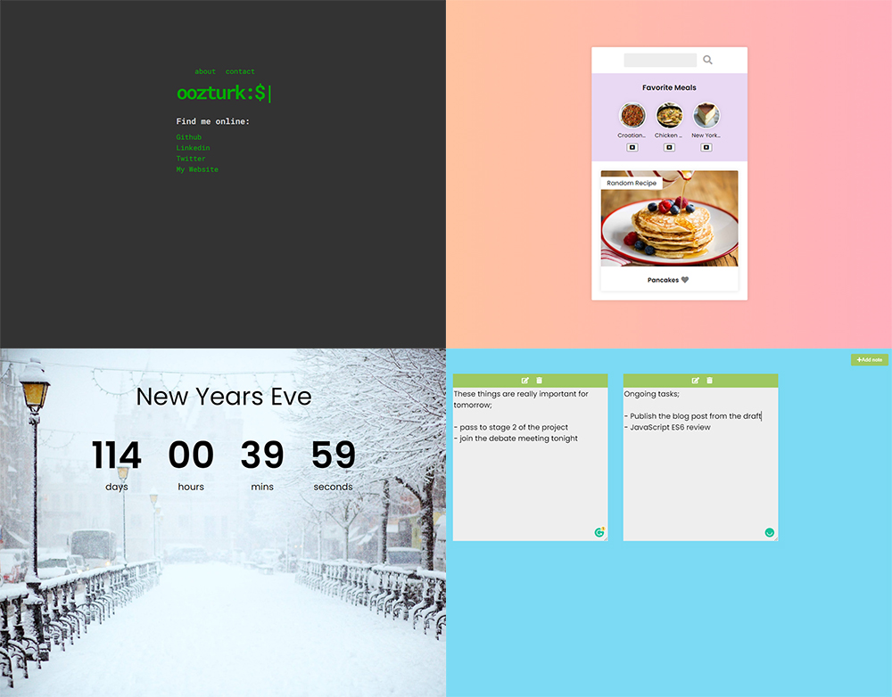

# Javascript-Fundamental-Projects

I made these projects simultaneously by following the youtube channels of users such as [Brad Traversy](https://github.com/bradtraversy),  [Florin Pop](https://github.com/florinpop17), [Simo Edwin](https://github.com/developedbyed), [John Smilga](https://github.com/john-smilga)
 
My main goal was to improve my skills in JavaScript and I am trying to continue with new projects 🖥
 
 
Demo of Selected Projects Here; 

- [Terminal Landing Page](https://ozerozturk.github.io/Javascript-fundamental-projects/Terminal-Landing-Page/index.html)  (Live Demo)

- [Weather App](https://ozerozturk.github.io/Javascript-fundamental-projects/Weather-App/index.html)  (Live Demo)

- [Recipe App](https://ozerozturk.github.io/Javascript-fundamental-projects/Recipe-App/index.html)  (Live Demo)

- [Analog Clock](https://ozerozturk.github.io/Javascript-fundamental-projects/Analog%20Clock/index.html)  (Live Demo)

- [Quiz App](https://ozerozturk.github.io/Javascript-fundamental-projects/Quiz-App/index.html)  (Live Demo)

- [Meditation App](https://ozerozturk.github.io/Javascript-fundamental-projects/Meditation-App/index.html)  (Live Demo)

- [Countdown Timer](https://ozerozturk.github.io/Javascript-fundamental-projects/Countdown-Timer/index.html)  (Live Demo)

- [Drag and Drop Sortable List](https://ozerozturk.github.io/Javascript-fundamental-projects/Drag-Drop-Sortable-List/index.html)  (Live Demo)

- [Notes App](https://ozerozturk.github.io/Javascript-fundamental-projects/Notes-App/index.html)  (Live Demo)

- [Video Project](https://ozerozturk.github.io/Javascript-fundamental-projects/Video-Project/index.html)  (Live Demo)

 

