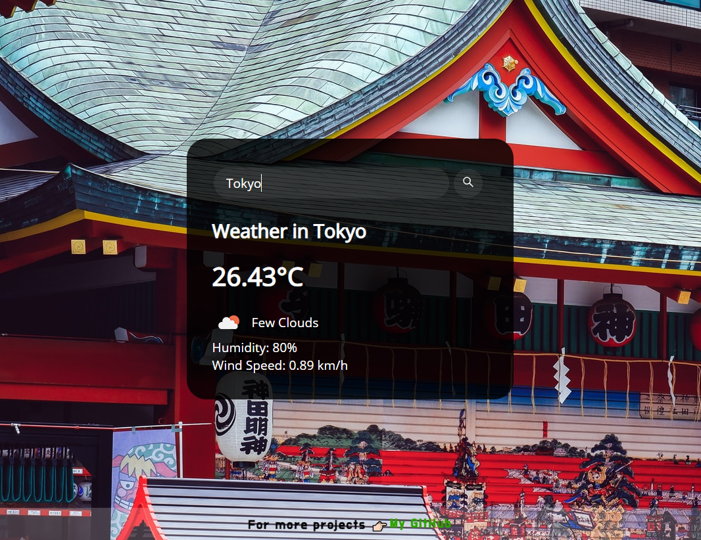

# Weather App

I used Weather API in this project. And I benefited from https://openweathermap.org/ for this API. There're some options to define your necessity. For instance units of measurement; standard, metric, imperial.

Photographs came directly from unsplash.com as a random selector, but also they're related to the cities which you're looking at using the search bar.

- [Weather App](https://ozerozturk.github.io/Javascript-fundamental-projects/Weather-App/index.html)  (Live Demo)

